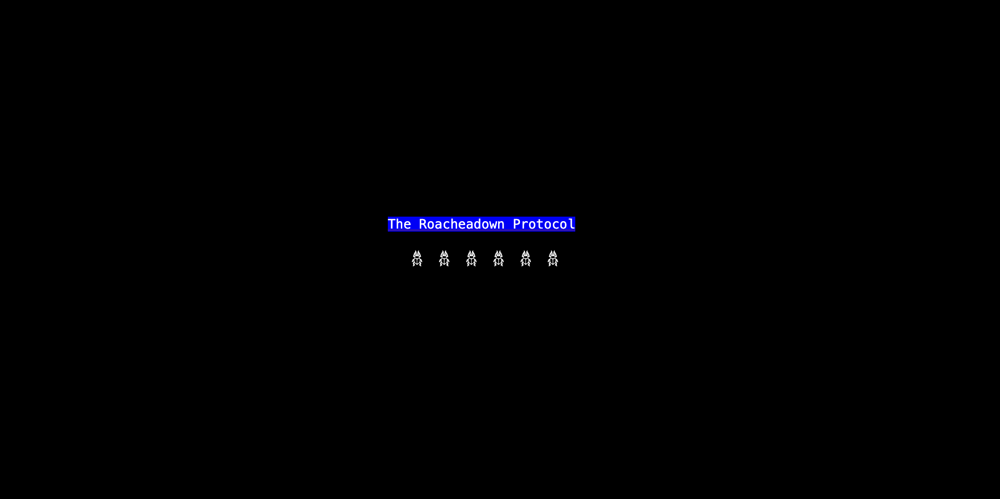
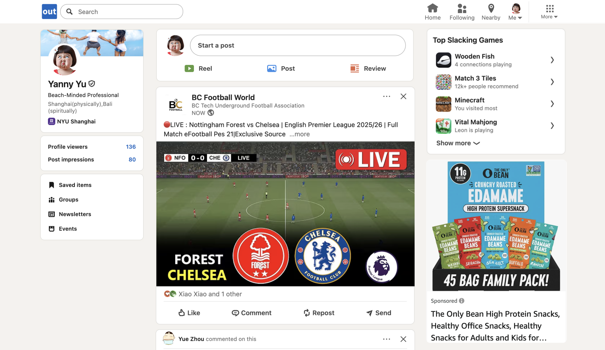

# Yanny ComLab Page
Welcome to my ComLab Homepage. 

Below you see my practices and projects throughout the semester:

* [Tutorial - How to smash roaches](tutorial)

The assignment requires us to create an absurd tutorial, either teach something useless or introduce in a way that make simple things ridiculous or extremely complicated. Thus, I create a tutorial to kill roaches, which includes interactive practices and funny break-down.

* [LinkedOut - My Shanzhai Website](project1)

This is my midterm project - a shanzhai website twisting Linkedin. It is named LinkedOut and designed to satirize Linkedin's elitism and hyprocisy.