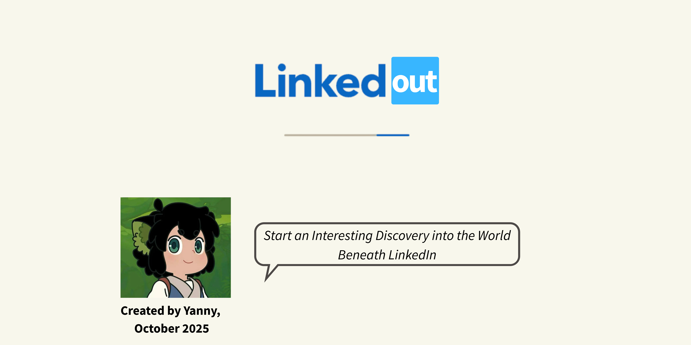
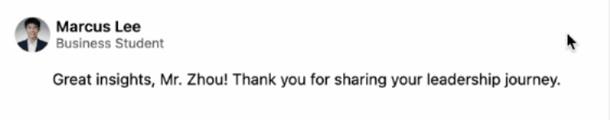

## Description: 

LinkedOut borrows the polished interface of LinkedIn to reveal what lies beneath curated professionalism. Through playful interactions, it invites users to hover, discover, and rethink what “connection” truly means.

## Abstract:

LinkedOut reinterprets the aesthetics and language of LinkedIn through a shanzhai lens—borrowing, twisting, and playfully subverting the culture of professional self-display. The project doesn’t aim to reject LinkedIn’s world of ambition and optimism, but to reveal the more authentic, sometimes humorous perspectives hidden under its surface. By using “hover” as a storytelling device, LinkedOut turns everyday interface gestures into moments of discovery—users glimpse unfiltered voices, shifting relationships, and the fluid boundary between the personal and the professional. The result is not simply a critique, but a reflection on how digital identities oscillate between sincerity and performance, distance and intimacy.




## Design and composition

I closely replicated LinkedIn’s layout, typography, and hierarchy to preserve its visual language ( except the final map page) and intentionally mislead visitors into believing they were navigating the real site. Hovering then becomes both a visual and conceptual device that exposes the gap between appearance and authenticity. Users can hover to uncover a commenter’s inner voice, to grab their seemingly busy “friends,” and to reveal their real status on the map. I mostly maintain LinkedIn’s Gestalt principles, using familiarity to create contrast. These small interactions—scrolling, hovering, clicking—turn passive browsing into active discovery, inviting reflection beneath professional polish.

## Technical Process

### HTML
```html
Homepage:
<div class="nav-top">
<div class="homepage-main-body">
	<div class="left-bar">
	<div class="container">
		<div class="post-header">
		<div class="post-content">
		<div class="comments-wrapper">
			<div class="comment-item">
			<div class="comment-item">
				...
	<div class="homepage-right-bar">


Network:
<div class="nav-top">
<div class="homepage-main-wrapper">
	<div class="network-left-bar">
	<div class="network-section">
           
           
           
           


           
           
           
           


           
           
           
           

Nearby:
<div class="nav-top">
<div class="nearby-right-bar">
<div class="nearby-main-body">
	      <div class="nearby-people" id="nearby-david">
           
           
       </div>
       <div class="nearby-people" id="nearby-tong">
           
           
       </div>
       	 … 
```
Each page begins with a `<div class="nav-top">` for the top navigation, followed by main containers such as .homepage-main-body, .network-section, and .nearby-main-body, which organize content horizontally from left to right. Within these, nested `<div> `elements manage components like posts, comments, and profile cards. Using the same class for all comments allows me to adjust their format collectively, maintaining visual consistency. Four distinct classes for network cards enable positional shifts on hover, creating a sense of motion and controlled chaos. On the mapping page, shared classes adjust overall size, while unique IDs define each individual’s location and enable targeted interactions.

## CSS
```css
 .network-section{
   background-color: white;
   display: flex;
   flex-wrap: wrap;
   gap: 2px;
   justify-content: center;
   align-items: flex-start;
   width: 760px;
   padding-top: 20px;
   border-radius: 0.8rem;
   border: 1px solid rgba(0,0,0,0.15);
   position: relative;
}
.network-section img{
   display: flex;
   width: 220px;
   height: auto;
   border-radius: 0.8rem;
   border: 1px solid rgba(0,0,0,0.15);
}
.run-1:hover{
   position: absolute;
   left:-70px;
   top: 150px;
}
.run-2:hover{
   position: absolute;
   left: 200px;
   top: 700px;
}
.run-3:hover{
   position: absolute;
   left: 100x;
   top: 1000px;
}
.run-4:hover{
   position: absolute;
   left: 300;
   top: 1500px;
}
```
In the Network page, I used Flexbox to organize profile cards within the `.network-section`. The container is set to `display: flex` with `flex-wrap: wrap`, arranging three images per row and multiple rows overall. Properties like `justify-content: center` ensure symmetrical margins, `align-items: flex-start` aligns items from the top, and `gap` maintains clear spacing between cards. Together, these create a clean, grid-like layout resembling LinkedIn’s orderly network. However, this structure collapses on hover—each card “escapes” and blinks chaotically. By setting the container’s position to `relative`, the profile cards can switch to `absolute` positioning when hovered, jumping to unpredictable coordinates. Interestingly, if the cursor remains in place, the cards flicker and tremble due to constant position recalculations. Although it may appear as a bug, I intentionally kept this behavior to reinforce the sense of instability and distance—reflecting how “busy” online connections often remain just out of reach.

## Technical Challenges

One challenge I faced was organizing the `<div>` hierarchy. Initially, I assigned classes and IDs randomly, which made layout control and styling difficult. Another significant issue was implementing sticky left and right bars. While it worked in early drafts, it failed in the final version because the sticky elements were inside a `display: flex` container. In some browsers, especially Safari, sticky positioning does not work reliably within flex or grid containers. To fix this, sticky elements may need to be placed in a standard block-level container or wrapped in an additional `<div>` outside the flex container. If I rebuilt the site, I would plan the hierarchy more carefully and structure sticky elements to avoid flex-related conflicts, ensuring consistent behavior across browsers and maintaining the intended layout.

## Reflection
In my first draft, I largely copied LinkedIn’s layout, changing only content and subtle design details. Leon pointed out that adhering too closely limited my ability to convey my own message—if the visual language is too familiar, viewers may overlook the content entirely. This feedback inspired me to experiment with website techniques like hover interactions and positional shifts to enhance storytelling and highlight authenticity beneath the polished surface. While these interactive elements work well conceptually, I am less satisfied with the overall polish and time management; my project ended up more humble compared to classmates who produced fully refined narratives. Moving forward, I would focus on balancing workload, refining layout precision, and expanding creative storytelling techniques. I also hope to explore more playful manipulations of interface elements to further challenge assumptions about digital identity and social connections.

## Credit
Huge thanks to Leon and TA Candy!